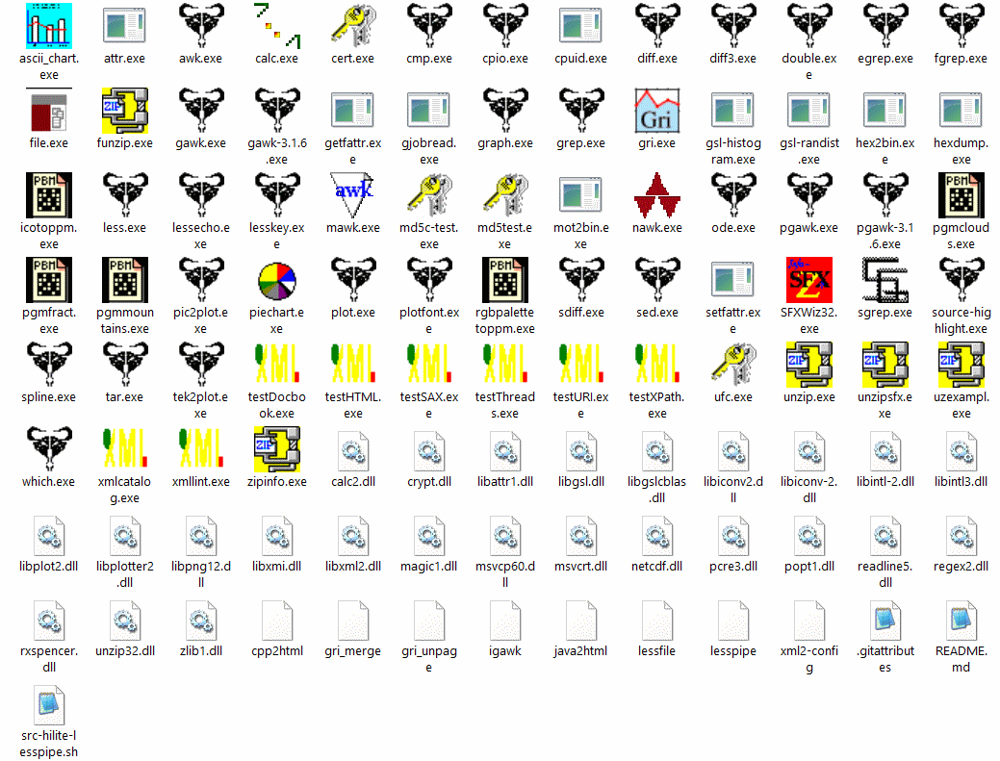

<h1>Useful-GnuWin32 - &nbsp; &nbsp; </h1>

 

<h3>The native builds of <a href="https://gnuwin32.sourceforge.net/">GnuWin32</a>, with an updated Windows-manifest from https://github.com/eladkarako/manifest .</h3>

Not all, just several useful ones,  
flat,  
including dependencies and OS-DLLs.  

<h4><em>As for the content:</em></h4>

 

Programs (Can Be Used In Windows' Standard CMD).
<em>Those are the ones you actually run.</em>
<pre>

[.exe
ascii_chart.exe
attr.exe
awk.exe
basename.exe
calc.exe
cat.exe
cert.exe
chgrp.exe
chmod.exe
chown.exe
chroot.exe
cksum.exe
cmp.exe
comm.exe
cp.exe
cpio.exe
cpuid.exe
csplit.exe
cut.exe
date.exe
dd.exe
df.exe
diff3.exe
diff.exe
dir.exe
dircolors.exe
dirname.exe
double.exe
du.exe
echo.exe
egrep.exe
env.exe
expand.exe
expr.exe
factor.exe
false.exe
fgrep.exe
file.exe
fmt.exe
fold.exe
funzip.exe
gawk-3.1.6.exe
gawk.exe
gdate.exe
gecho.exe
getfattr.exe
ginstall.exe
gjobread.exe
gln.exe
gmkdir.exe
graph.exe
grep.exe
gri.exe
grmdir.exe
gsl-histogram.exe
gsl-randist.exe
gsort.exe
head.exe
hex2bin.exe
hexdump.exe
hostid.exe
hostname.exe
icotoppm.exe
id.exe
install.exe
join.exe
kill.exe
less.exe
lessecho.exe
lesskey.exe
link.exe
ln.exe
logname.exe
ls.exe
mawk.exe
md5c-test.exe
md5sum.exe
md5test.exe
mkdir.exe
mkfifo.exe
mknod.exe
mot2bin.exe
mv.exe
nawk.exe
nice.exe
nl.exe
nohup.exe
od.exe
ode.exe
paste.exe
pathchk.exe
pgawk-3.1.6.exe
pgawk.exe
pgmclouds.exe
pgmfract.exe
pgmmountains.exe
pic2plot.exe
piechart.exe
pinky.exe
plot.exe
plotfont.exe
pr.exe
printenv.exe
printf.exe
ptx.exe
pwd.exe
readlink.exe
rgbpalettetoppm.exe
rm.exe
rmdir.exe
sdiff.exe
sed.exe
seq.exe
setfattr.exe
setuidgid.exe
SFXWiz32.exe
sgrep.exe
sha1sum.exe
shred.exe
sleep.exe
sort.exe
source-highlight.exe
spline.exe
split.exe
stat.exe
stty.exe
su.exe
sum.exe
sync.exe
tac.exe
tail.exe
tar.exe
tee.exe
tek2plot.exe
test.exe
testDocbook.exe
testHTML.exe
testSAX.exe
testThreads.exe
testURI.exe
testXPath.exe
touch.exe
tr.exe
true.exe
tsort.exe
tty.exe
ufc.exe
uname.exe
unexpand.exe
uniq.exe
unlink.exe
unzip.exe
unzipsfx.exe
uptime.exe
users.exe
uzexampl.exe
vdir.exe
wc.exe
which.exe
who.exe
whoami.exe
xmlcatalog.exe
xmllint.exe
yes.exe
zip.exe
zipcloak.exe
zipinfo.exe
zipnote.exe
zipsplit.exe
</pre>

Libs/Dependencies (All That Are Needed).
<pre>

bzip2.dll
calc2.dll
crypt.dll
libattr1.dll
libeay32.dll
libgsl.dll
libgslcblas.dll
libiconv2.dll
libiconv-2.dll
libintl3.dll
libintl-2.dll
libplot2.dll
libplotter2.dll
libpng12.dll
libssl32.dll
libxmi.dll
libxml2.dll
magic1.dll
msvcp60.dll
msvcrt.dll
netcdf.dll
pcre3.dll
popt1.dll
readline5.dll
regex2.dll
rxspencer.dll
unzip32.dll
zip32z64.dll
zlib1.dll
</pre>

bash/su scripts, used by the programs.
<pre>
gri_merge
gri_unpage
igawk
java2html
lessfile
lesspipe
src-hilite-lesspipe.sh
xml2-config
</pre>
