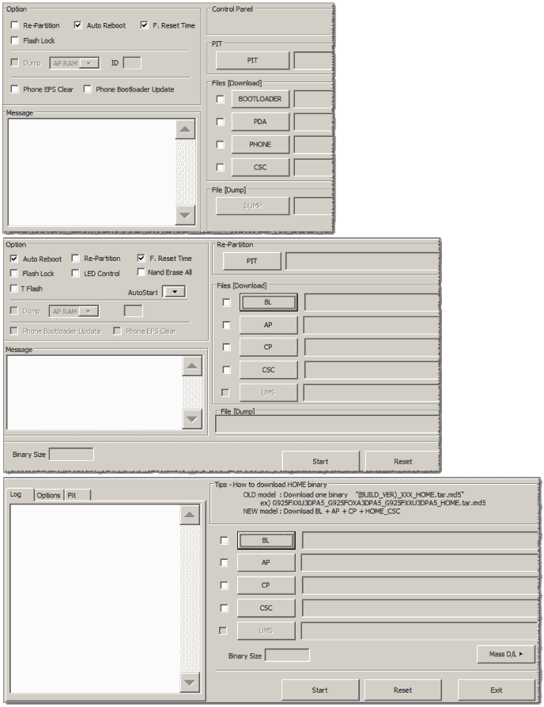

<h1> Download Samsung Odin - &nbsp; &nbsp; </h1>

<table>
<thead><tr><td>Version</td><td>Changelog</td></tr><thead>
<tbody>
<tr>
  <td><a href="https://raw.githubusercontent.com/eladkarako/odin/master/resources/v3.13.1.0.zip">v3.13.1.0</a></td>
  <td>October 18th, 2017
    <pre>Better support for Android Oreo 8.x
Suitable for Samsung S7/S8 series. 
Adds support for firmware-compression LZ4.
<h4>I've translated the program from <em>Korean</em> to <em>English</em> (w/ Google Translate..).</h4></pre>
  </td>
</tr>
<tr>
  <td><del>v3.12.10.0</del></td>
  <td>(fill date later..)
    <pre>removing TFLASH option,
fixing offset-parsing for TAR-files with file-size over 8GB.
adding CustomerService popup-warning feature.
fix in COM-ports identification-core.
minor UX changes (USERDATA)</pre>
  </td>
</tr>
<tr>
  <td><del>v3.12.7.0</del></td>
  <td>(fill date later..)
    <pre>TAR-parsing - fix read-offset.</pre>
  </td>
</tr>
<tr>
  <td><del>v3.12.5.0</del></td>
  <td>(fill date later..)
    <pre>to change erase command and report erase partitions
to add IMEI condition optionto change erase command and report erase partitions
to add IMEI condition option</pre>
  </td>
</tr>
<tr>
  <td><a href="https://raw.githubusercontent.com/eladkarako/odin/master/resources/v3.12.3.0.zip">v3.12.3.0</a></td>
  <td>November 11th, 2016
    <pre>fix the error of flashing for Galaxy S7/S7e USA model (AT&amp;T, T-mobile)
supported by the new models of 2016 such as Galaxy S7, S7 edge, Note 6 and Note 7
fix to avoid cross-download for hero ATT</pre>
  </td>
</tr>
<tr>
  <td><a href="https://raw.githubusercontent.com/eladkarako/odin/master/resources/v3.11.1.0.zip">v3.11.1.0</a></td>
  <td>March 16th, 2016
    <pre>Added improved support files for Flash HOME_CSC _... Galaxy S7, S7 edge 
(no file _... HOME_CSC wipe data, wipe data file _... CSC)
Recommended for Marshmallow firmware.</pre>
  </td>
</tr>
<tr>
  <td><a href="https://raw.githubusercontent.com/eladkarako/odin/master/resources/v3.10.7.1.zip">v3.10.7.1</a></td>
  <td>May 26th, 2015
    <pre>RTN for Sprint has added.
Supports latest devices (Samsung Galaxy S7/S7 Edge, S6/S6 Edge, Note 5 etc)
Highly recommended for Lollipop firmware.
<strong>Note: Windows XP support removed (and from future versions).</strong></pre>
  </td>
</tr>
<tr>
  <td><del>v3.10.6.0</del></td>
  <td>May 26th, 2015
    <pre>Added UFS Support device type.
Added UX of Mass D / W (56 port).
Changed UX (some option changes).
Supports Galaxy S6 / S6 Edge latest models.
Comes with Bug fixes and more enhancements.
  </td>
</tr>
<tr>
  <td><a href="https://raw.githubusercontent.com/eladkarako/odin/master/resources/v3.10.5.0.zip">v3.10.5.0</a></td>
  <td>December 19th, 2014
    <pre>Support ufs device type.
With feature to implement UX of Mass D/W (56 port)
With a change UX of Odin3 (removed some options)</pre>
  </td>
</tr>
<tr>
  <td><del>v3.10.3.0</del></td>
  <td>December 19th, 2014
    <pre>Involved to getDeviceInfo (protocol_version 3)
Support phone-feature: 1MB xmit size for device type PARTITION_DEV_TYPE_NAND_WB1
With a sequence-change of RQT_INIT_DATA_SALESCODE for preventing parameter-reset.
Added support for firmware-file Drag&amp;Drop</pre>
  </td>
</tr>
<tr>
  <td><a href="https://raw.githubusercontent.com/eladkarako/odin/master/resources/v3.10.0.0.zip">v3.10.0.0</a></td>
  <td>September 25th, 2013
    <pre>Improved interface with fixes to some issues.
Improved compatibility.</pre>
  </td>
</tr>
<tr>
  <td><a href="https://raw.githubusercontent.com/eladkarako/odin/master/resources/v3.09.3.0.zip">v3.09.3.0</a></td>
  <td>June 21st, 2013
    <pre>Adding support for SM-R350 features: 4MB xmit size for device type PARTITION_DEV_TYPE_NOR.
bug-fix to support TAR files offset with file-size over 4GB.</pre>
  </td>
</tr>
<tr>
  <td><del>v3.07.0.0</del></td>
  <td>June 21st, 2013
    <pre>Specially designed for the new generation Samsung smartphones like Samsung Galaxy S3, 
Galaxy Note 2 and others.</pre>
  </td>
</tr>
<tr>
  <td><a href="https://raw.githubusercontent.com/eladkarako/odin/master/resources/v1.85.0.0.zip">v1.85.0.0</a></td>
  <td>April 15th, 2011
    <pre>If you own old device and have some compatibility issues with latest updated version,
try this one.</pre>
  </td>
</tr>
</tbody>
</table>

GUI differences between versions of Odin 
 

<h3>Always Use <code>AP</code></h3>
With Odin you can flash a partial image (for example just the <code>modem.bin</code>, using the <code>CP</code> button), but it is <strong>strongly recommended</strong> to always flash using the <code>AP</code> button, partry because of the built-in checksum mechanism and partly because Odin not always does a good job matching partition to binary image when flashing single-binary files.

Making your "firmware" out-of a single binary file is <em>not that difficult</em>!

For this you <strong>need a cygwin copy on your Windows PC</strong> or an <strong>access to a linux machine</strong> with terminal <em>(a virtual-machine will do just fine too!)</em>.

Copy the binary file, for example <code>modem.bin</code>
to your cygwin home Opening your cygwin-shell (usually at c:\cygwin\home\USERNAME\)

Now, from <strong>within</strong> cygwin shell run the following commands:
<pre>
tar -H ustar -c modem.bin  &gt;MODEM_I9500.tar
md5sum -t MODEM_I9500.tar &gt;&gt;MODEM_I9500.tar
mv        MODEM_I9500.tar   MODEM_I9500.tar.md5
</pre>
<blockquote>or..
<pre>tar --create --format=ustar <strong>modem.bin</strong> &gt;<strong>MODEM_I9500.tar</strong>
md5sum --text <strong>MODEM_I9500.tar</strong> &gt;&gt;<strong>MODEM_I9500.tar</strong>
mv --force --verbose <strong>MODEM_I9500.tar</strong> <strong>MODEM_I9500.tar.md5</strong>
</pre>
</blockquote>

<h2>Download Samsung USB Drivers</h1>

<table>
<tbody>
<tr><td>
<a href="https://raw.githubusercontent.com/eladkarako/odin/master/resources/SAMSUNG_USB_Driver_for_Mobile_Phones.zip">Samsung USB Drivers v1.5.6.3</a> 
May 3rd, 2017.

Official installer for all of the USB drivers. 
Shipped with Samsung KIES and SmartSwitch. 
Contains:
<pre>
SAMSUNG 1xEVDO USB Modem Phone Driver
SAMSUNG Android ADB Interface Driver
SAMSUNG Android Composite ADB Interface Driver
SAMSUNG Android USB Driver
SAMSUNG Marvel Diag Device Driver
SAMSUNG Mobile MTP Device Driver
SAMSUNG Mobile USB CDC Composite Device Driver
SAMSUNG Mobile USB Composite Device Driver
SAMSUNG Mobile USB Connectivity Device Driver
SAMSUNG Mobile USB Device Management Serial Port Driver
SAMSUNG Mobile USB Diagnostic Serial Port
SAMSUNG Mobile USB Modem Driver
SAMSUNG Mobile USB Networking (CDC/EEM Ethernet) Driver
SAMSUNG Mobile USB OBEX Serial Port Driver
SAMSUNG Mobile USB QC RMNET Driver
SAMSUNG Mobile USB QCRMNET Filter Driver
SAMSUNG Mobile USB QCRMNET Network Adapter Driver
SAMSUNG Mobile USB Remote NDIS Network Device Driver
SAMSUNG Mobile USB RMNET Driver
SAMSUNG Mobile USB RMNET Network Adapter Driver
SAMSUNG SDB Interface Driver
</pre>
</td>
</tr>
</tbody>
</table>
