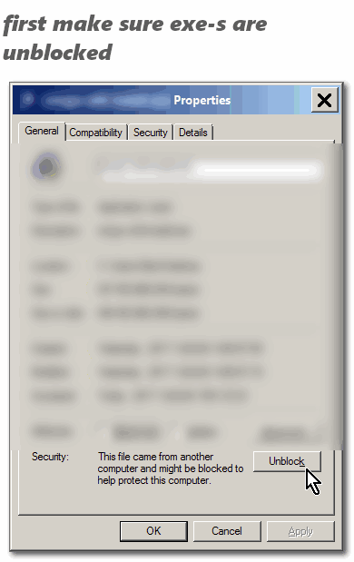
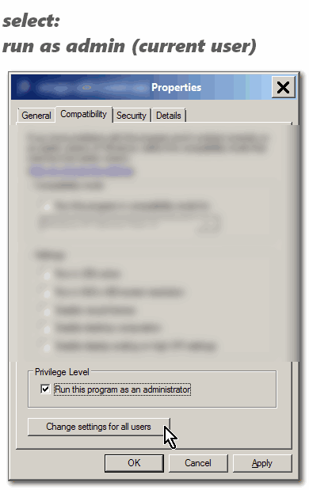
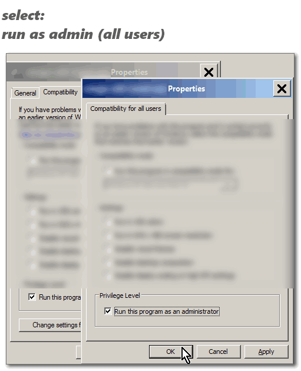

<h1> Unlocker</h1>

version 1.9.2 32bit/64bit 

no installer 
flat. 
with windows-10 manifest support. 

to install: 

uninstall any old version you might have.

download and keep the 32/64 bit, place anywhere.

run <code>uninstall.reg</code> from the <code>resource</code> folder, 
to remove leftovers from the registry.
run CCleaner, the registry cleaner part - to make sure all leftovers are gone.
 
you might need to manually remove keys starting with <code>{DDE4BEEB-DDE6-48FD-8EB5-035C09923F83}</code> from: 
<code>HKEY_USERS\*******************\Software\Microsoft\Windows\CurrentVersion\Shell Extensions\Cached</code> 
instead of ******************* look under all ssid(s) available on the machine.
 
a reboot and running ccleaner again (and reboot again...) will remove the cached ones too.

unblock all the files and mark the checkbox of run as admin.

 
 
 

add this to your HOSTS file to avoid internet access:
<pre>
0.0.0.0 unlocker.emptyloop.com
0.0.0.0 ccollomb.free.fr
0.0.0.0 www.emptyloop.com
</pre>

run <code>UnlockerInject32.exe</code> as admin and check if you've got similar values as in <code>install_recorded.reg</code>. You should have a context-menu, and once you'll run <code>Unlocker.exe</code> and <code>UnlockerAssistant.exe</code> once you'll have a little tray icon which you can right-click and select to start on every boot (you don't need it).

 

You can have the 32bit run on a 64bit pc with no-praticular issues too, 
but try use your matching architecture.